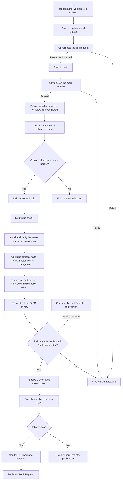

# Releasing

This runbook describes how a committed Perenna version becomes a GitHub
Release and PyPI release, and how stable versions also enter the MCP Registry.
The executable contract is the
[`Publish` workflow](../../.github/workflows/publish.yml).

## One-time PyPI setup

Register a pending Trusted Publisher on PyPI with these values:

| Field | Value |
| --- | --- |
| Owner | `scarletkc` |
| Repository | `Perenna` |
| Workflow | `publish.yml` |
| Environment | `pypi` |

The publish job receives `contents: write` for the GitHub Release and
`id-token: write` for PyPI. PyPI validates that OIDC identity and returns a
short-lived upload token; the repository does not store a long-lived PyPI API
token.

## Release flow



The publish workflow runs only after the `Validate` workflow succeeds for a push to
`main`. Pull-request CI cannot release directly. GitHub Release and PyPI
publication run serially. Stable releases then enter the MCP Registry job after
PyPI succeeds. That job retries when Registry validation has not observed the
new PyPI version yet. Authentication, ownership, and manifest errors fail
immediately.

## Optional hand-written release notes

Add `docs/release-notes/<version>.md` in the same change as the version update
when a release needs curated highlights. The file must start with a
`## <title>` heading and contain a non-empty body. For example:

```markdown
## Highlights

- Describe the user-visible change.
```

The workflow inserts that section before its generated `## Changelog`, which
lists commits since the previous `v*` tag and links to the full comparison.
Omit the file when the generated changelog is sufficient.

## Publish a version

1. Run the version tool from the repository root:

   ```bash
   uv run python scripts/bump_version.py <version>
   ```

   It updates `src/perenna/__init__.py`, `server.json`, both plugin manifests,
   both repository Marketplaces, and the plugin's generated Skill mirror.
   Versions must use strict semantic versioning, such as `0.2.0` or
   `0.2.0-rc.1`.
2. Optionally add the matching hand-written release note described above.
   You can start it in the same command with
   `--note "<release-note-title>"`, then write its body.
3. Run the standard checks in [Testing](testing.md).
4. Commit the release change and merge it through the normal review path.
5. After `main` CI succeeds, verify that the publish workflow created the
   GitHub Release, completed the PyPI upload, and published stable versions to
   the MCP Registry.
6. Install `perenna` in a new process and confirm the reported version.

Do not edit generated plugin copies directly. After changing the canonical
Skill or plugin metadata, run `uv run python scripts/sync_plugin.py`. Installed
Marketplace copies use the plugin version as their update key, so bump the
Perenna version before distributing those changes to existing plugin users.
Changing other files without changing `__version__` does not create a release.
