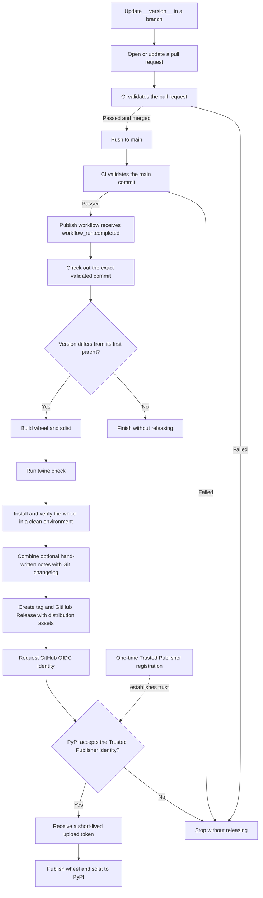

# Releasing

This runbook describes how a committed Perenna version becomes a PyPI release.
The executable contract is the
[`Publish` workflow](../../.github/workflows/publish.yml).

## One-time PyPI setup

Register a pending Trusted Publisher on PyPI with these values:

| Field | Value |
| --- | --- |
| Owner | `scarletkc` |
| Repository | `Perenna` |
| Workflow | `publish.yml` |
| Environment | `pypi` |

The publish job receives `contents: write` for the GitHub Release and
`id-token: write` for PyPI. PyPI validates that OIDC identity and returns a
short-lived upload token; the repository does not store a long-lived PyPI API
token.

## Release flow



The publish workflow runs only after the `Validate` workflow succeeds for a push to
`main`. Pull-request CI cannot release directly. Every release step runs in one
serial job, and any failure prevents all later steps.

## Optional hand-written release notes

Add `docs/release-notes/<version>.md` in the same change as the version update
when a release needs curated highlights. The file must start with a
`## <title>` heading and contain a non-empty body. For example:

```markdown
## Highlights

- Describe the user-visible change.
```

The workflow inserts that section before its generated `## Changelog`, which
lists commits since the previous `v*` tag and links to the full comparison.
Omit the file when the generated changelog is sufficient.

## Publish a version

1. Update `__version__` in
   [`src/perenna/__init__.py`](../../src/perenna/__init__.py). Hatchling reads
   the package version from that single source.
2. Optionally add the matching hand-written release note described above.
3. Run the standard checks in [Testing](testing.md).
4. Commit the release change and merge it through the normal review path.
5. After `main` CI succeeds, verify that the publish workflow created the
   GitHub Release and completed the PyPI upload.
6. Install `perenna` in a new process and confirm the reported version.

Changing other files without changing `__version__` does not create a release.
